# SIMANKA

**SIMANKA** stands for "**Sistem Informasi Manajemen Kepegawaian Polsek Cikampek**" which on english can read "**Employee Management Information System for Polsek Cikampek**". This website is designed to handle almost all tasks related to managing police officers at Polsek Cikampek.

With **SIMANKA**, users can manage police personnel data, handle promotions or rank changes, validate attendance, and generate various reports—such as officer data reports, attendance reports, and rank change reports. It also supports attendance tracking and private data management.

The system has two types of users: **Admin**, who manages the entire system, and **police officers**, who use it to access services or update their personal information.

With this system can makes managing employee-related tasks at Polsek Cikampek much easier and more organized.

## The tech used on this web is

<table>
    <tr>
        <td></td>
        <td></td>
        <td></td>
        <td></td>
        <td></td>
        <td></td>
    </tr>
</table>

## Methodology

**Waterfall** is used while making this system because it's **one of the models most commonly used on software development**. This development model is **linear**, starting from the initial planning stage to the final stage end of system maintenance. Each subsequent stage cannot be started before the previous stage is completed, and it is not possible to return or repeat the previous stage.

This development model consists of **Requirement analysis and definition**, **System and software design**, **Implementation and unit testing**, **Integration and system testing**, and **Operation and maintenance**. <ins>**But on this project Operation and maintenance is not included**</ins>.

    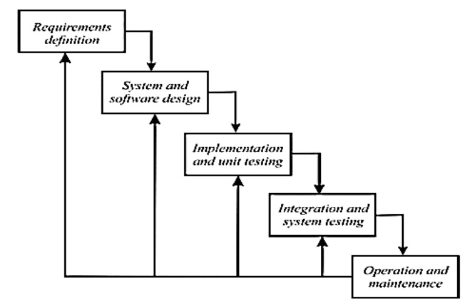 Source Picture:
    <a href="https://journal.peradaban.ac.id/index.php/jsitp/article/view/756" style="color:blue;"> 
        Romadhon, Yudhistira, and Mukrodin 2021
    </a>

 
Based on the methodology used in this project (Waterfall, excluding Operation and Maintenance), the steps can be explained simply as follows:

1. **Requirement Analysis and Definition**  
   Gather needs, problems, and data to design a system solution through interviews and literature review.

2. **System and Software Design**  
   Design the workflow of the new system using a flowmap, based on the previous analysis.

3. **Implementation and Unit Testing**  
   Build the system using UML (Use Case, Diagrams) and test each part to ensure it works as designed.

4. **Integration and System Testing**  
   Combine all system components into one and test the whole system using blackbox testing methods.

## Overview of the SIMANKA Website

<ins>**Note:**</ins> The data used in this software (especially in the image below) is fake data or just a dummy data <ins>**not real data**</ins>.

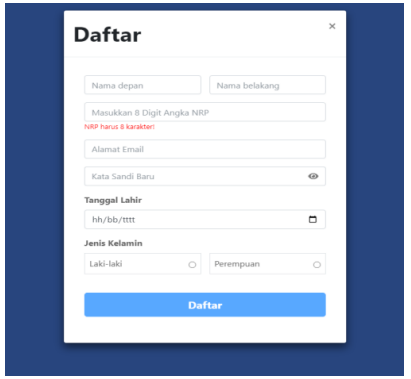
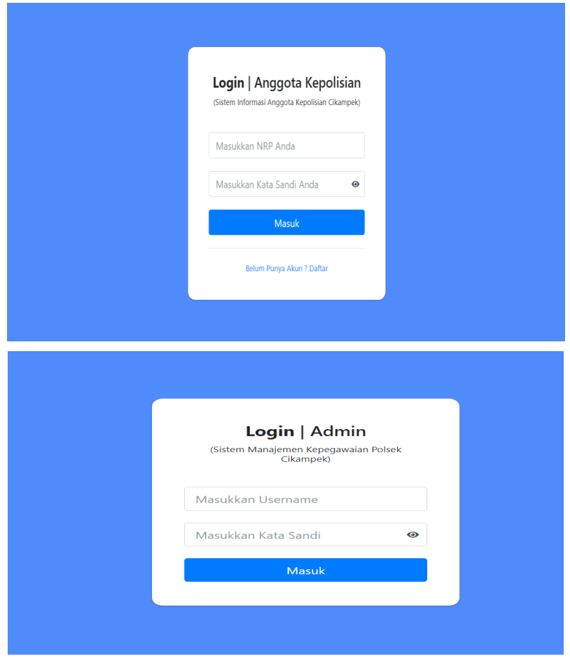
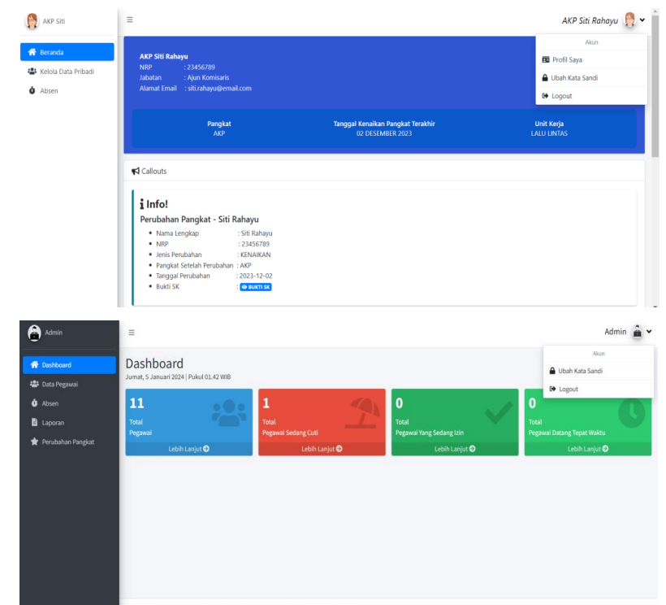
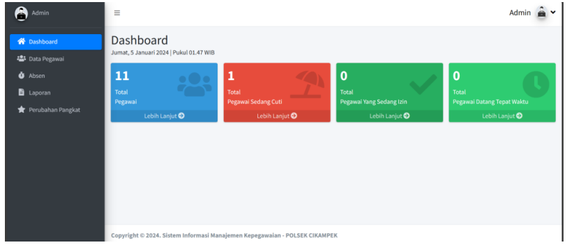
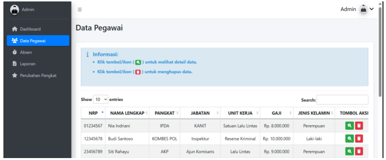
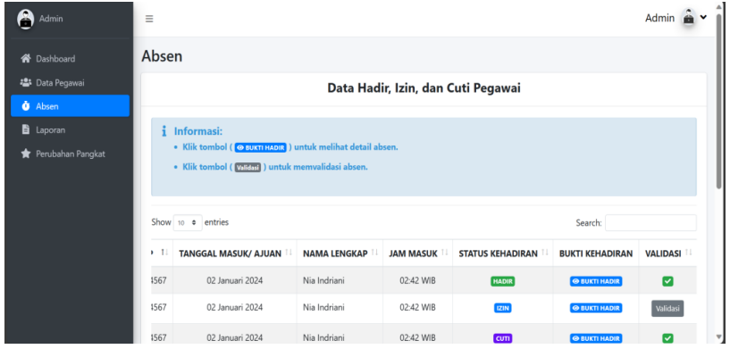
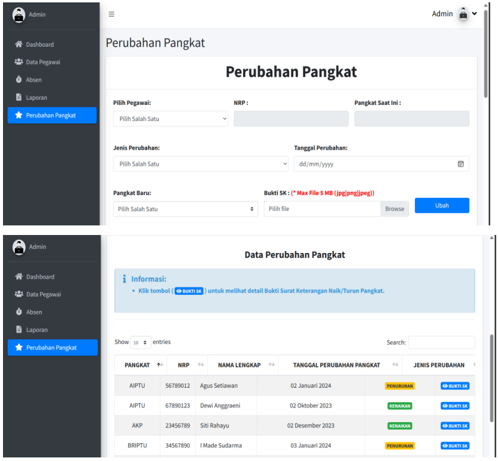
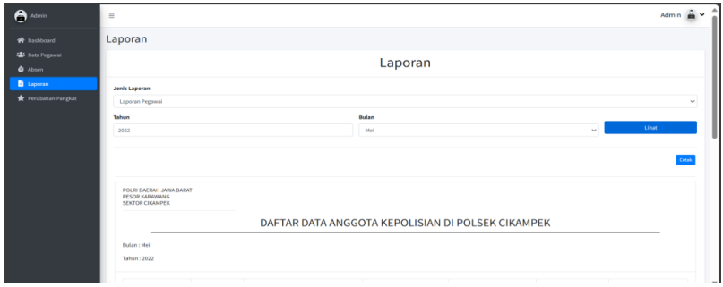
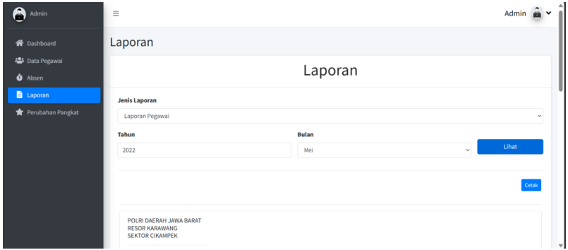
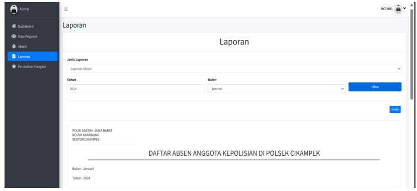

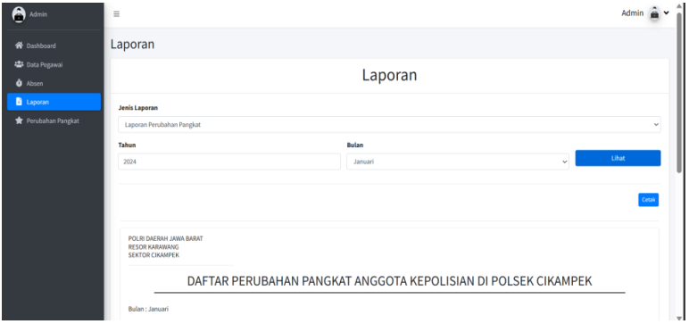
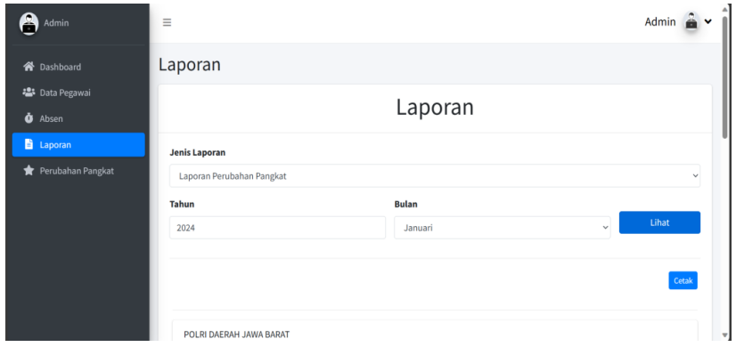
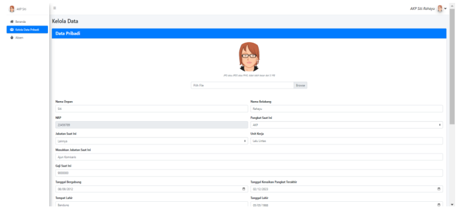
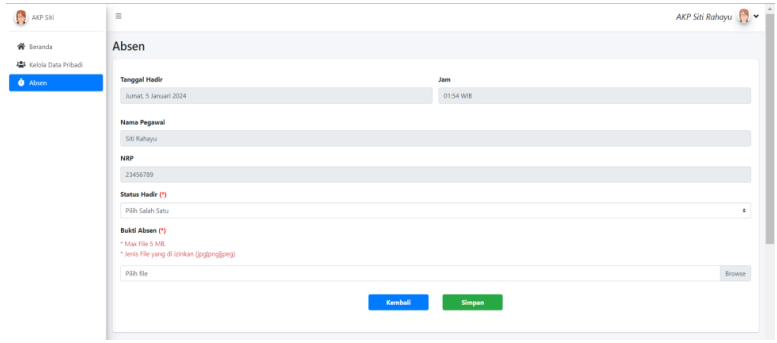

 
With this software can makes managing staff data faster, safer, and easier.
